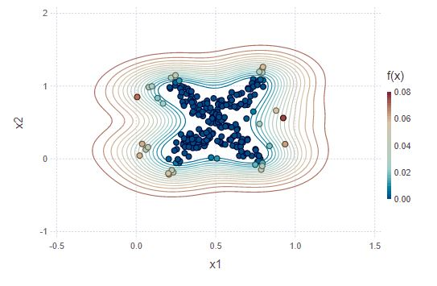

# SVDD.jl
_A Julia package for Support Vector Data Description._

[](https://travis-ci.com/englhardt/SVDD.jl)
[](https://coveralls.io/github/englhardt/SVDD.jl?branch=master)

This package implements one-class classifiers and based on support vector data description.
The package has been developed as part of a benchmark suite for [active-learning](https://en.wikipedia.org/wiki/Active_learning_(machine_learning)) strategies for one-class classification. For more information about this research project, see the [OCAL project](https://www.ipd.kit.edu/ocal/) website, and the companion paper.

> Holger Trittenbach, Adrian Englhardt, Klemens Böhm, "An Overview and a Benchmark of Active Learning for One-Class Classification" [arXiv:1808.04759](https://arxiv.org/abs/1808.04759), 14 Aug 2018

## Installation
This package works with Julia 0.6. We plan to upgrade to the latest Julia version once all dependencies support 1.0.
This package is not registered yet. Please use the following command to clone the package.
```Julia
Pkg.clone("https://github.com/englhardt/SVDD.jl.git")
```
## Overview

[One-class classifiers](https://en.wikipedia.org/wiki/One-class_classification) learn to identify if objects belong to a specific class, often used for outlier detection.
The package implements several one-class classifiers, and strategies to initialize parameters.
The jupyter notebook in `examples` gives a jump start on how to use this package.



### Classifiers

Currently, the classifiers have been implemented as optimization problems based on [JuMP](https://github.com/JuliaOpt/JuMP.jl).
The package includes:

* Vanilla Support Vector Data Description (VanillaSVDD) [1]
* SVDD with negative examples (SVDDNeg) [1]
* Semi-supervised Anomaly Detection (SSAD) [2]

### Parameter Initialization

There are two types of parameters to estimate for the classifiers: cost parameters and a kernel function.
The packages includes the following strategies to initialize parameters.

* _Gauss Kernel gamma_
  * Rule of Scott [3]
  * Rule of Silverman [4]
  * Fixed Gamma
* _Cost parameters C_
  * Rule of Tax [1]
  * Binary Search
  * Fixed C

### Conventions
* _Classification scores:_ The classifiers return scores by the following convention:
  * score > 0 for outliers
  * score <= 0 for inliers
* _Data Format:_ The data is expected to be in column major order, i.e., first array dimension is the attribute, second is the observation.
  * `[1 2 3 4; 5 6 7 8]` is a 2x4 Array with 2 attributes and 4 observations

## Authors
We welcome contributions and bug reports.

This package is developed and maintained by [Holger Trittenbach](https://github.com/holtri/) and [Adrian Englhardt](https://github.com/englhardt).

## References

[1] Tax, David MJ, and Robert PW Duin. "Support vector data description." Machine learning 54.1 (2004): 45-66.

[2] Görnitz, Nico, et al. "Toward supervised anomaly detection." Journal of Artificial Intelligence Research 46 (2013): 235-262.

[3] Scott, David W. Multivariate density estimation: theory, practice, and visualization. John Wiley & Sons, 2015.

[4] Silverman, Bernard W. Density estimation for statistics and data analysis. Routledge, 2018.
